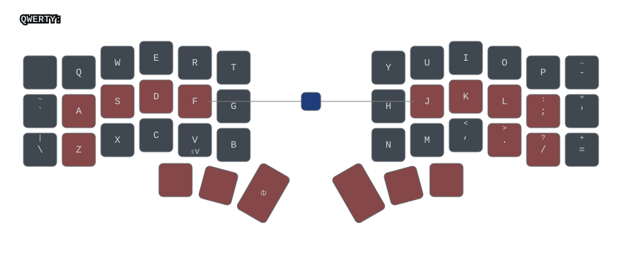
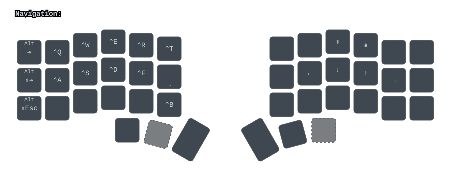
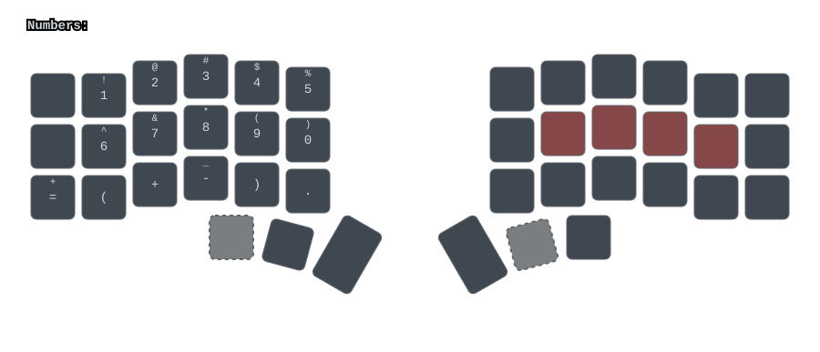
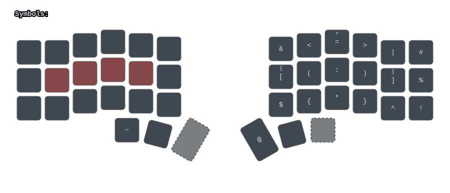
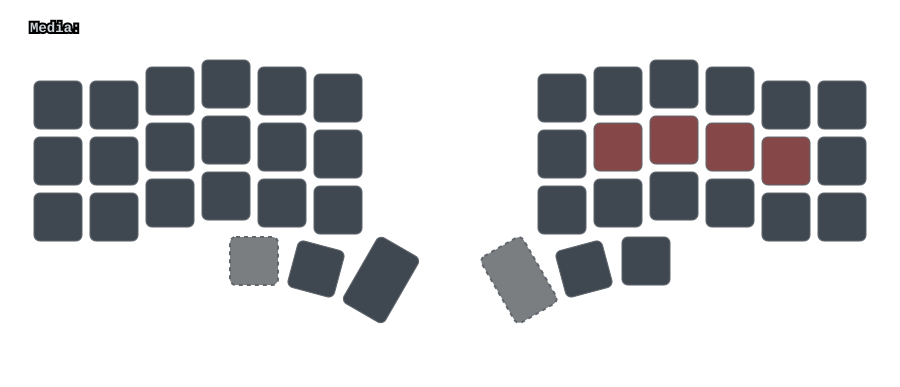
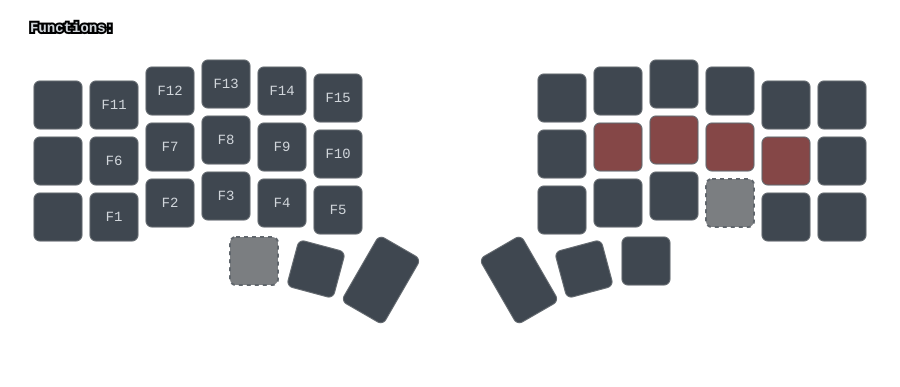
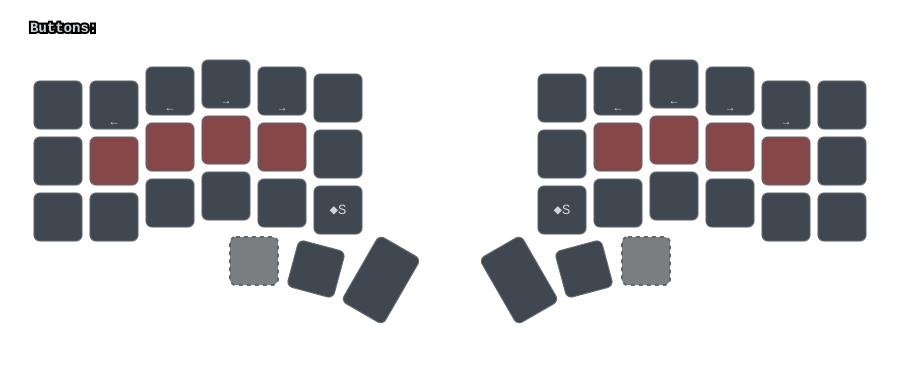
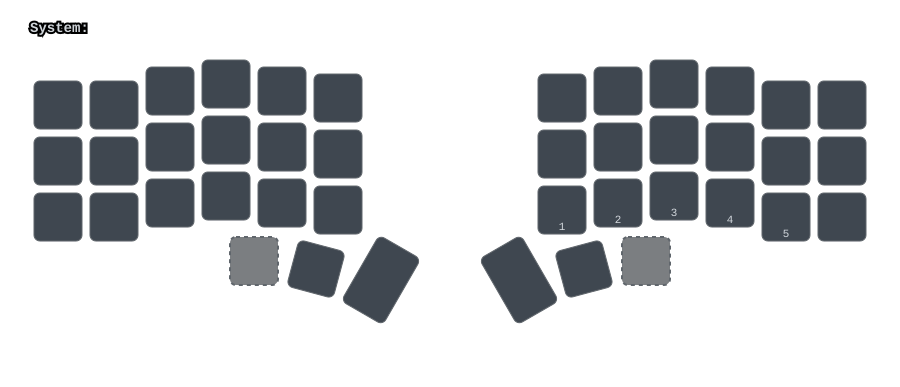

# zmk-config-corne-xiao

A [ZMK](https://zmk.dev/) firmware configuration for a **Corne Xiao v1** split keyboard, ported to stock ZMK `main` from [Townk's ZMK configuration](https://github.com/Townk/zmk-config).

The config builds split left/right firmware for the Corne Xiao (`xiao_ble//zmk`) with:

- an **OLED** on the central (left) half (ZMK's built-in status screen showing layer + output),
- **home-row modifiers** (Timeless home-row mods, based on Urob),
- a **Caps-Word** combo,
- **Windows-oriented** Navigation and Buttons layers,
- and a shared `LAYER_ADAPTER` that maps a 60-key logical layout onto the 42-key Corne physical matrix (also building the v2 revision).

> Layout guide images (`.svg`) for every layer live in [`media/`](media/) and are generated with [Keymap-Drawer](https://keymap-drawer.streamlit.app/) — run `./media/generate.sh` to regenerate them.

---

## Hardware configuration

- **Board:** Seeed Studio XIAO BLE (`xiao_ble//zmk`).
- **Shield:** `corne_xiao_v1_left` / `corne_xiao_v1_right` (and `corne_xiao_v2_*`), plus the `rgbled_adapter` shield for optional WS2812 underglow.
- **Controller:** one XIAO per half; the **left** half is the split *central* role.
- **Display:** a 128×32 SSD1306 OLED on the central (left) half, using ZMK's built-in status screen (layer + output indicator).
- **Layout:** 6-column Corne, 42 physical keys (see `boards/shields/corne_xiao_v1/keypos_def/corne_xiao_v1.dtsi` and the `LAYER_ADAPTER` in `corne_xiao_v1.keymap`).

### Build matrix (`build.yaml`)

The GitHub Actions workflow builds both revisions and halves:

| Board | Shield | Notes |
|-------|--------|-------|
| `xiao_ble//zmk` | `corne_xiao_v1_left rgbled_adapter` | v1 left |
| `xiao_ble//zmk` | `corne_xiao_v1_right rgbled_adapter` | v1 right |
| `xiao_ble//zmk` | `corne_xiao_v2_left rgbled_adapter` | v2 left (+ `studio-rpc-usb-uart`) |
| `xiao_ble//zmk` | `corne_xiao_v2_right rgbled_adapter` | v2 right |

### Kconfig notes (`config/corne_xiao_v1.conf`)

| Setting | Purpose |
|---------|---------|
| `CONFIG_NFCT_PINS_AS_GPIOS=y` | Use the XIAO's NFC pads as GPIOs. |
| `CONFIG_ZMK_SLEEP=y` | Deep sleep for battery life. |
| `CONFIG_ZMK_DISPLAY=y` | Enables the display subsystem (LVGL + SSD1306) with the built-in status screen. |
| `CONFIG_ZMK_HID_CONSUMER_REPORT_USAGES_FULL=y` | Full consumer HID usages for Media-layer volume/app shortcuts. |

> Unlike some OLED builds, this config uses ZMK's **built-in status screen** (layer + output). A custom LVGL status screen was extensively trialled but consistently hard-hangs this board's boot when any LVGL child widget is created, so the proven built-in screen is used instead.

### Modules (`config/west.yml`)

| Module | Provides |
|--------|----------|
| `zmkfirmware/zmk@main` | Core ZMK (LVGL 9). |
| `caksoylar/zmk-rgbled-widget` | RGB/underglow helpers. |
| `dhruvinsh/zmk-tri-state` | Tri-state (chorded layer) behaviors. |

---

## Layers

There are **8 layers**. A brief summary of each layer follows; the images are generated by Keymap-Drawer in the dark, MDI-glyph style matching Townk's reference (blue = layer activation, red = system).

| Image | Layer | Index |
|-------|-------|-------|
| [`layer0-main.svg`](media/layer0-main.svg) | QWERTY | 0 |
| [`layer1-navigation.svg`](media/layer1-navigation.svg) | Navigation | 1 |
| [`layer2-numbers.svg`](media/layer2-numbers.svg) | Numbers | 2 |
| [`layer3-symbols.svg`](media/layer3-symbols.svg) | Symbols | 3 |
| [`layer4-media.svg`](media/layer4-media.svg) | Media | 4 |
| [`layer5-functions.svg`](media/layer5-functions.svg) | Functions | 5 |
| [`layer6-buttons.svg`](media/layer6-buttons.svg) | Buttons | 6 |
| [`layer7-system.svg`](media/layer7-system.svg) | System | 7 |

#### German (QWERTZ) labeled images

The same layout can be viewed with **German QWERTZ** symbol labels (Y/Z swapped, umlauts `ö ä ü`, `ß`, and the German punctuation/number-row positions), rendered from the same ZMK keymap without changing it:

| Image | Layer |
|-------|-------|
| [`layer0-main-de.svg`](media/layer0-main-de.svg) | QWERTY |
| [`layer1-navigation-de.svg`](media/layer1-navigation-de.svg) | Navigation |
| [`layer2-numbers-de.svg`](media/layer2-numbers-de.svg) | Numbers |
| [`layer3-symbols-de.svg`](media/layer3-symbols-de.svg) | Symbols |
| [`layer4-media-de.svg`](media/layer4-media-de.svg) | Media |
| [`layer5-functions-de.svg`](media/layer5-functions-de.svg) | Functions |
| [`layer6-buttons-de.svg`](media/layer6-buttons-de.svg) | Buttons |
| [`layer7-system-de.svg`](media/layer7-system-de.svg) | System |

Regenerate with `./media/generate-de.sh` (uses `media/keymap-config-de.yaml`, which `media/generate_de_config.py` builds from the base config).

### Layer 0 — QWERTY (base)

The default layer:

- **Home-row modifiers** on both halves (`A S D F` / `J K L ;`) using **Timeless home-row mods** (`hml`/`hmr` with a `require-prior-idle-ms`; the Shift-key rows use `hsl`/`hsr` so Shift can't get stuck).
  - Left: `A` → Ctrl, `S` → Gui, `D` → Alt, `F` → Shift.
  - Right: `J` → Shift, `K` → Alt, `L` → Gui, `;` → Ctrl.
- **Left hand:** `Tab`, `Q W E R T`, `` ` ``, `A S D F G`, `Z X C V B`, with `Bspc`/`Del` and `End`/`PgUp` in the inner columns.
- **Right hand:** `Y U I O P`, `H J K L`, `N M ,`, `-` `=` `'`, with `Home`/`PgUp` and `End`/`PgDn` in the inner columns.
- **Thumb cluster:** left: `Alt`-layer-momentary, `OS`, layer-Nav/L-SYM, right: End, PgDn, Media-Enter, Num-Space.
- **Caps-Word combo:** pressing both **Shift** keys together toggles `CAPS_WORD` (works only on this layer).
- Inner columns give `Hyphen`/`Equals` (`-` `=`), `Delete`, `Backspace`, `Home`/`PgUp` and `End`/`PgDn`.

### Layer 1 — Navigation (Windows)

Windows-oriented movement and window management:

- **Cursor / page keys:** `Left/Down/Up/Right` arrows, `Home`, `End`, `PgUp`, `PgDn`.
- **Window / app management:** `Win+Tab` (Task View), `Alt+Tab` / `Shift+Alt+Tab`, `Win+1..5`, `Win+Ctrl+Left/Right` (virtual desktops), `Win+D` (desktop), etc.
- **Editing:** `Win+E` (Explorer), `Ctrl+Z/X/C/V` region on the home row.

### Layer 2 — Numbers

- Full `1 2 3 4 5` on the left hand and `6 7 8 9 0` on the right, plus keypad operators (`* / + -`), `( )`, `Carat`, `%`, and a keypad `.`.
- `Tab`, keypad `Enter`, `=` and arrow/paging keys retained from the adjacent columns.

### Layer 3 — Symbols

- A full symbol layer: `? ! @ # $ % & *` punctuation, brackets `[] {} () <>`, `| \ /`, `: ;` and `^`.
- Home-row holds give the modifiers (`Ctrl/Shift/Alt/Gui`) without leaving the character cluster.

### Layer 4 — Media

- Playback: play/pause, next/previous, stop.
- Volume: up/down, mute.
- Brightness: up/down.

### Layer 5 — Functions

- Function keys `F1`–`F20` arranged in rows.
- `Home`, `End`, `PgUp`, `PgDn` kept in the inner columns.

### Layer 6 — Buttons (macOS-app shortcuts, Windows equivalents)

- Mac-style quick actions mapped to **Windows** shortcuts: Launchpad (`Win+E`), Mission Control (`Win+Tab`), Spotlight (`Win+S`).
- **Cut / Copy / Paste / Undo / Redo** and window tiles (`Win+Up/Down/Left/Right`).
- The `Mac` legend keys stand for these system/application shortcuts (see `specialkeys.dtsi`), not literal macOS keys.

### Layer 7 — System

- **Bootloader** on both outer top keys.
- **Reset** (`&sys_reset`) and **output toggle** (`OUT_TOG`).
- **Bluetooth:** select profile `0..4`, clear bond.
- **Power:** external power toggle and `Ctrl+PrtSc` (power shortcut).
- Layer toggle for System (`tog L_SYS`).

---

## References & credits

- **[Townk/zmk-config](https://github.com/Townk/zmk-config)** — original layout and Keymap-Drawer style this config is ported from.
- **[Urob's Timeless Home Row Mods](https://github.com/urob/zmk-config)** — home-row modifier tuning.
- **[Keymap-Drawer](https://keymap-drawer.streamlit.app/)** — layer SVG generation (`./media/generate.sh`).
- **[caksoylar/zmk-rgbled-widget](https://github.com/caksoylar/zmk-rgbled-widget)** and **[dhruvinsh/zmk-tri-state](https://github.com/dhruvinsh/zmk-tri-state)** — build modules.
